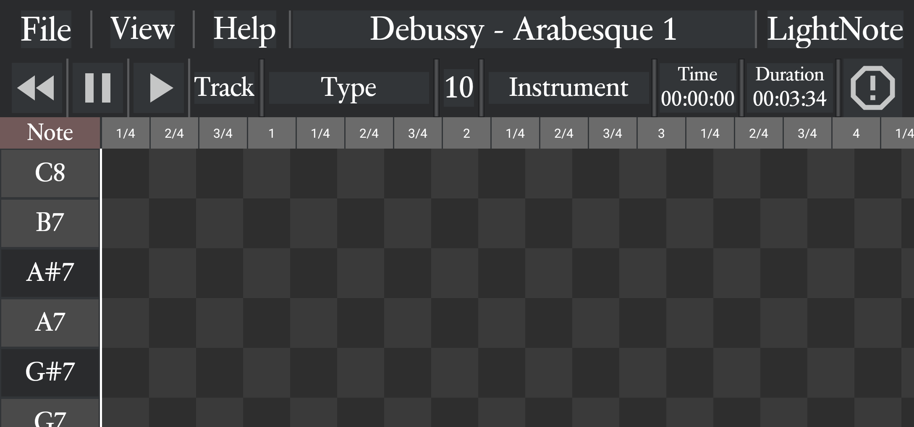

# LightNote

LightNote is an app that streamlines midi playback and provides a means of visualizing music through a piano roll/keys system. The app has a very intuitive design, and we will continue expand built upon the app for a full Google Play release.

<picture>
 <a href = "https://raw.githubusercontent.com/JonathanLacabe/LightNote/refs/heads/master/PlayerScreen.png">
  <source media="(prefers-color-scheme: dark)" srcset="PlayerScreen.png" width="1089px">
  
 </a>
</picture>

## Top Bar

### File
This button reveals the following options:
-Open...
-Exit

Pressing Open... allows the user to select a new midi file to import (which we will exit them out of their current file), while "Exit" will exit the user from the midi player and bring them to the front page.

### View

Here, the user can select between the options "Piano Roll Editor" and "Staff Editor". Currently, the Piano Roll is the only available option.

### Help

The user can see the options "GitHub" and "YouTube", to find links to this page and to a future playlist that will contain video tutorials for every feature in the app. By the time this app is released to the greater public, full-fledged youtube tutorials (with captions) for the app will have been created. 

## Middle Bar

### Rewind
This button resets the audio file and the "Time Taken" text (see below), setting the audio from the beginning.

### Pause
This button pauses the audio. The tick at which the user paused is stored to allow for perfect unpausing using the Play button.

### Play
This is the button that plays the music - if the user presses it while the music is already playing, nothing will occur. When the file is paused, this button will unpause the music.

### Track Menu
This button allows the user to see the different tracks that are apart of their file - the name of each track will appear, and the information relating to them (like the channel, type, and instrument name) will occur. 

### Type
In Midi files, there are four types that a track could possibly have: Instrument, Rhythm, Audio 16-bit, Audio 24-bit, Audio 32-bit, and ReWire.

### Channel
Every individual track needs to have its own "channel", of which a file can have a maximum of 16. Channel 10 is specific to drums. The midi-sequencing algorithm ([see here](https://github.com/JonathanLacabe/LightNote/blob/master/app/src/main/java/io/github/jonathanlacabe/lightnote/MidiPlaybackHandler.kt)) is able to determine the channel of each instrument.

### Instrument
Each instrument of the file is named correctly - when the file is first loaded, the information from the track in the first channel will be presented. There are a total of 128 possible instruments.

### Time Taken
While the file is playing, the time taken text will increase by the second. If the user were to pause at 0.99 seconds, the "getElapsedTimeInMillis()" function in [MidiPlaybackHandler.kt](https://github.com/JonathanLacabe/LightNote/blob/master/app/src/main/java/io/github/jonathanlacabe/lightnote/MidiPlaybackHandler.kt) would remember that 0.99 seconds, so when the user unpauses, the time taken text will change after 0.01 seconds, maintaining the accuracy of the time. This prevents the text becoming increasingly incorrect the more the user pauses.

### Time Duration
The duration text informs the user of the total duration of the music file they have imported. This algorithmically determined from the internal midi writing of the file - see the "onActivityResult" function of the [NewActivity.kt](https://github.com/JonathanLacabe/LightNote/blob/master/app/src/main/java/io/github/jonathanlacabe/lightnote/NewActivity.kt)
 for how this was programmed.
### Panic Button
Despite the best efforts of the programmer, there were still some minor issues that occurred during playback, such as if one pauses and unpauses too many times, which results in any violin instruments creating a drone of sorts. Thus, this button was made as a preventative measure before we could figure out what would need to be changed to solve this rare issue. The Panic Button completely restarts the file, devoid of any memory of the pauses or actions of the user beyond changing the time.

## Subdivision Bar
Above the Piano Roll is the subdivision bar, which scrolls horizontally alongside the piano roll. Each section is 1/4th time, with each full bar being counted. Currently, the piano roll is designed only for 4/4 music - in the future, full compatability for different meters and even mixed-meter will be added.

## Piano Keys
On the left lower side of the screen, there is full piano of 72 notes, with the sharps given dark keys and natural given white keys. These notes range from C2 to C8, experimentally determined to be the minimum and maximum notes that can be played on modern Android phones (tested through the playing of chromatic scales). These keys scroll vertically with the piano roll.

## Piano Roll
The piano roll section is directly alligned vertically with the piano keys, but it can move horizontally as well independently of the piano keys. Each box represents 1/4th of a note, with each row representing one key and each column/subdivision representing one beat of the music, providing a place for users to visualize the music.

In future updates, we will finalize the conversion of midi files into perfectly synthesized lightshows.
